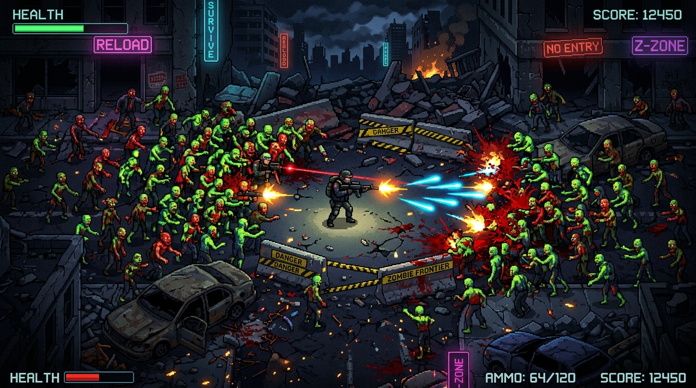

# 🧟 Zombie Frontier

> **A fast-paced, top-down 2D graphical survival shooter featuring wave defense, tactical weapons, enemy AI, boss encounters, quests, and full economy.**

---

### 👤 Developer Credit
- **Developer & Creator**: **Niket Raj**
- **Original Repository**: [Niketraj08/ZombieFrontierSFML-bug-code-with-c-](https://github.com/Niketraj08/ZombieFrontierSFML-bug-code-with-c-)
- **Platform**: Web (React 19 + TypeScript + HTML5 Canvas + Tailwind CSS + Web Audio API)

---

## 📖 Game Overview & Lore

You awaken in the heart of a fallen quarantine zone. Hordes of infected mutants roam the desolate streets. Armed initially with a standard sidearm and limited reserves, you must scavenge supplies, eliminate hostile zombie waves, fulfill survival quests, upgrade your gear at the armory, and prepare for the ultimate showdown against the terrifying **Necro Lord**.

---

## 🔄 Gameplay Process & Progression ("Proccess")

### 1. Early Survival (Waves 1 – 2)
* **Kite and Aim**: Keep moving using `W A S D` while aiming with precision using the mouse.
* **Conserve Ammo**: Standard Pistol fires 12-round clips. Press `R` to reload before getting cornered.
* **Collect Drops**: Fallen zombies drop **Gold Coins** (`$`), **Medkits** (`+`), and **Grenades** (`G`). Pick them up by walking over them.

### 2. Economy & Armory Upgrades (Waves 2 – 4)
* Open the **Armory** (`P` or `E`) between or during skirmishes.
* Buy high-tier weapons:
  * **Shotgun** (450G): 5-pellet spread, ideal for clearing dense zombie packs.
  * **Assault Rifle** (900G): High fire rate automatic weapon for rapid suppression.
  * **Plasma Rifle** (1700G): High-energy piercing projectiles dealing 62 base damage.
* Buy **Ammo Packs** (80G), extra **Medkits** (70G), and upgrade **Armor** (250G) for permanent damage mitigation.

### 3. Combat Tactics & Enemy Types
* **Walker** (Green): Slow standard zombie, moderate HP.
* **Runner** (Yellow): Fast sprinters that charge directly at the survivor.
* **Spitter** (Blue): Long-range mutant that shoots acidic projectiles from up to 700 units away.
* **Brute** (Red): Heavy tank that unleashes dangerous 3-way spread projectiles when within 520 units.
* **Grenades (`G`)**: Deals massive 90 damage in a 155-radius explosive blast.

### 4. Quest Progression & Level Ups
* Press `Q` to track active quests:
  * **First Blood**: Slay 5 enemies (+150G, +100 XP).
  * **Zombie Hunter**: Slay 20 enemies (+500G, +350 XP).
  * **Survivor**: Reach Level 5 (+750G, +500 XP).
  * **Armed**: Own 3 different weapons (+900G, +500 XP).
* Leveling up increases max HP, restores health to full, enhances permanent armor, and increases weapon damage multiplier.

### 5. Boss Showdown (Wave 5+ / Level 5)
* When you reach **Level 5**, the **Necro Lord Boss** unlocks.
* The Necro Lord features high health, a pulsing dark aura, vicious melee bonus damage, and wave-scaled attributes.
* Defeating the Necro Lord awards +1,500 Gold, +1,500 XP, +10,000 Score, and triggers **Victory**!

---

## 🎮 Controls Reference

| Action | Desktop Hotkey | Alternate / Mouse |
|---|---|---|
| **Move Survivor** | `W` `A` `S` `D` | Arrow Keys (`↑` `←` `↓` `→`) |
| **Aim Weapon** | Mouse Cursor | Crosshair Tracking |
| **Fire Weapon** | Left Click / Hold | Auto-fire supported |
| **Equip Weapons** | `1`, `2`, `3`, `4` | On-screen HUD / Inventory |
| **Reload Magazine** | `R` | Quick Reload button on HUD |
| **Throw Grenade** | `G` | HUD Grenade button |
| **Use Medkit (+50 HP)** | `H` | HUD Medkit button |
| **Armory / Shop** | `P` or `E` | HUD "Shop [P]" button |
| **Inventory** | `I` or `TAB` | HUD "Inv [I]" button |
| **Quest Log** | `Q` | HUD "Quests [Q]" button |
| **Player Stats** | `T` | HUD "Stats [T]" button |
| **Quick Save** | `F5` | LocalStorage Save button |
| **Quick Load** | `F9` | LocalStorage Load button |
| **Pause / Close Panel** | `ESC` | Pause menu |

---

## 🛠️ Technical Architecture

- **Rendering Engine**: Optimized HTML5 2D Canvas matching SFML viewport (`1280x720`) with 2D world space (`3200x2200`).
- **Sound System**: Real-time Web Audio API synthesizer for punchy retro sound effects without external audio asset downloads.
- **State Management**: Zero-lag continuous loop running at up to 144 FPS with delta-time physics normalization.
- **Persistence**: Browser `localStorage` save system preserving player statistics, inventory, owned weapons, active wave, and completed quests.

---

## 👨‍💻 Developer & Credits

**Zombie Frontier**  
Created & Developed by: **Niket Raj**  
Email: [niketrajkvs@gmail.com](mailto:niketrajkvs@gmail.com)  
GitHub: [@Niketraj08](https://github.com/Niketraj08)  

*Built with passion for high-intensity top-down survival gaming.*
